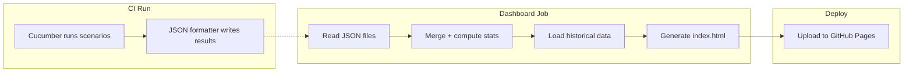

# How to Build a Test Results Dashboard for Your E2E Suite

**Tags:** `testing` · `dashboard` · `github-actions` · `github-pages` · `cucumber` · `playwright` · `javascript` · `ci-cd`

---

## Table of contents

- [Why a dashboard?](#why-a-dashboard)
- [Prerequisites](#prerequisites)
- [Step 1 — Make Cucumber write structured data](#step-1--make-cucumber-write-structured-data)
- [Step 2 — Wire CI to preserve results across runs](#step-2--wire-ci-to-preserve-results-across-runs)
- [Step 3 — Build the dashboard generator](#step-3--build-the-dashboard-generator)
- [Step 4 — Deploy to GitHub Pages](#step-4--deploy-to-github-pages)
- [Step 5 — Catch flaky tests with automatic reruns](#step-5--catch-flaky-tests-with-automatic-reruns)
- [Accessing the dashboard](#accessing-the-dashboard)
- [Going further](#going-further)

---

## Why a dashboard?

You run your E2E tests, they pass or fail, and the CI log tells you what
happened. But over time you start asking questions that a raw log can't
answer:

- Is the pass rate going up or down?
- Which scenarios fail most often?
- Are some tests flaky — passing one run and failing the next?
- How did this week's runs compare to last week's?

A dashboard answers all of those at a glance. It turns a stream of CI runs
into a historical record you can browse, filter, and share.

The approach in this guide builds a static dashboard that:

- Lives on **GitHub Pages** — free, no servers, no database
- Updates automatically after every CI run
- Shows **pass/fail/skip/flaky** counts per test layer and overall
- Renders a **trend chart** of pass rate over time
- Lists **every scenario** in a sortable, filterable table
- Highlights **flaky tests** using both rerun data and historical comparison
- Requires **zero new dependencies** — Cucumber's built-in JSON formatter
  and Chart.js from CDN are all you need



---

## Prerequisites

### What you should already have

This guide assumes you have a working Cucumber.js + Playwright project
similar to the one in this repo. Specifically:

| Item | Why you need it |
|------|-----------------|
| **Cucumber profiles** in `cucumber.json` | Profiles define which formatters run; you'll add JSON output to them |
| **GitHub Actions CI** | The dashboard is generated and deployed inside CI — it doesn't run locally |
| **`actions/upload-artifact`** used in CI | You'll upload JSON results so a downstream job can consume them |

### What you should know

| Topic | Resource |
|-------|----------|
| **Cucumber JS profiles** | [Cucumber JS docs — Profiles](https://github.com/cucumber/cucumber-js/blob/main/docs/profiles.md) |
| **GitHub Actions workflows** | [GitHub Actions docs](https://docs.github.com/en/actions/using-workflows) |
| **Cucumber JSON formatter** | [Cucumber JS docs — Formatters](https://github.com/cucumber/cucumber-js/blob/main/docs/formatters.md) |
| **Node.js** | Basic `fs` and `path` module usage — enough to read JSON and write HTML |

### The starting point

Before this guide, your project probably looks like this — a `cucumber.json`
with profiles that output HTML reports, and a CI workflow that runs the
tests:

```json
{
  "ui": {
    "format": ["progress", "html:reports/ui-report.html"],
    "paths": ["e2e/features/ui/**/*.feature"]
  }
}
```

```yaml
jobs:
  test-ui:
    steps:
      - run: npx cucumber-js --profile ui
```

By the end of this guide you'll have added structured JSON output, CI
artifact wiring, a dashboard generator script, a GitHub Pages deploy job,
and automatic flaky detection via reruns.

---

## Step 1 — Make Cucumber write structured data

Cucumber's HTML reports are human-readable but hard to parse
programmatically. The JSON formatter outputs the same data in a structured
format that you can feed into a script.

### Modify cucumber.json

Add a `json:<path>` entry to the `format` array in every profile. Each
profile should write to its own file so you can tell layers apart later.

**Before:**

```json
{
  "ui": {
    "format": ["progress", "html:reports/ui-report.html"]
  },
  "api": {
    "format": ["progress", "html:reports/api-report.html"]
  }
}
```

**After:**

```json
{
  "ui": {
    "format": ["progress", "html:reports/ui-report.html", "json:reports/ui-results.json"]
  },
  "api": {
    "format": ["progress", "html:reports/api-report.html", "json:reports/api-results.json"]
  }
}
```

Use a naming convention that maps profile name to file name:

| Profile | Output file |
|---------|-------------|
| `default` | `reports/cucumber-results.json` |
| `ui` | `reports/ui-results.json` |
| `api` | `reports/api-results.json` |
| `db` | `reports/db-results.json` |
| `judge` | `reports/judge-results.json` |
| `rerun` | `reports/rerun-results.json` |

### What the JSON looks like

The JSON formatter produces an array of feature objects, each containing
scenario elements with their steps and results. Here's the shape you'll
be parsing:

```json
[
  {
    "keyword": "Feature",
    "name": "Login via API",
    "uri": "e2e/features/api/auth/login.feature",
    "tags": [{ "name": "@api" }],
    "elements": [
      {
        "keyword": "Scenario",
        "name": "Successful login returns a token",
        "line": 4,
        "type": "scenario",
        "steps": [
          {
            "keyword": "When ",
            "name": "I log in via API with email ...",
            "result": {
              "status": "passed",
              "duration": 1234000000
            }
          }
        ]
      }
    ]
  }
]
```

Key fields your generator script will read:

| Field | Path | What it contains |
|-------|------|------------------|
| Status | `element.steps[].result.status` | `"passed"`, `"failed"`, `"skipped"`, `"ambiguous"` |
| Duration | `element.steps[].result.duration` | Nanoseconds — divide by 1,000,000 to get milliseconds |
| Error | `element.steps[].result.error_message` | Stack trace or error text (only when status is `"failed"`) |
| Tags | `element.tags[].name` + `feature.tags[].name` | Tag strings like `"@api"`, `"@smoke"` |
| Feature URI | `feature.uri` | The `.feature` file path |
| Line number | `element.line` | Scenario line within the feature file |

> Duration is in **nanoseconds**, not milliseconds. Your generator script
> needs to divide by 1,000,000 to get a human-readable number. Cucumber v12
> uses this legacy JSON format — it's stable and well-documented.

### Verify it works

Run one profile locally and check that the JSON file appears:

```bash
npx cucumber-js --profile ui
cat reports/ui-results.json | head -c 500
```

You should see valid JSON output. If the file is empty or contains `[]`,
check that your feature files have scenarios (not just a feature with an
empty body).

### Why not parse the HTML report instead?

The HTML report is a pre-rendered document — the numbers are buried inside
DOM elements, CSS classes, and formatting. Parsing it with cheerio or
jsdom is fragile and slow. The JSON formatter gives you the raw data with
zero parsing overhead.

---

## Step 2 — Wire CI to preserve results across runs

The JSON files are written during test execution, but CI runners are
ephemeral — they disappear when the job ends. You need to upload them as
**artifacts** so a downstream job can download and process them.

### Add artifact upload to each test job

In your CI workflow (`.github/workflows/e2e-tests.yml`), add an upload
step after each test run step. Use `if: always()` so results are captured
even when tests fail.

```yaml
test-api:
  steps:
    - name: Run API tests
      run: npx cucumber-js --profile api

    - name: Upload API results
      if: always()
      uses: actions/upload-artifact@v4
      with:
        name: api-results
        path: reports/api-results.json
```

Repeat for every layer (api, db, ui, judge). Each layer gets its own
artifact name:

| Job | Artifact name | File |
|-----|---------------|------|
| `test-api` | `api-results` | `reports/api-results.json` |
| `test-db` | `db-results` | `reports/db-results.json` |
| `test-ui` | `ui-results` | `reports/ui-results.json` |
| `test-judge` | `judge-results` | `reports/judge-results.json` |

### Why if: always()?

Without it, the upload step is skipped when the test step exits with a
non-zero code (i.e., when tests fail). You want the results uploaded
regardless — a failed run is just as important for the dashboard as a
passing one.

### Parallel jobs, separate artifacts

Each test job runs in its own VM, so there's no filename collision. Each
job gets its own `reports/` directory, its own `ui-results.json`, and its
own artifact. The dashboard job (added in Step 4) downloads all of them
into a single directory using their artifact names.

---

## Step 3 — Build the dashboard generator

This is the core of the project — a Node.js script that reads the JSON
files, computes statistics, loads historical data, and generates a
self-contained HTML page.

### What the script does

```
Inputs:
  --api       reports/api-results.json
  --db        reports/db-results.json
  --ui        reports/ui-results.json
  --judge     reports/judge-results.json
  --history   _site/runs.jsonl
  --out       _site/index.html
  --run-id    (from GitHub Actions)
  --run-number
  --branch
  --commit

Processing:
  1. Parse each layer's JSON → extract scenarios, steps, statuses
  2. Merge into a single dataset
  3. Compute per-layer and overall statistics
  4. Load historical runs from runs.jsonl
  5. Detect flaky scenarios (via history comparison)
  6. Append current run to history
  7. Generate index.html with embedded data + Chart.js

Output:
  _site/index.html    (self-contained dashboard)
  _site/runs.jsonl    (appended historical data)
```

### Where to put it

Create `dashboard/generate.js` at the project root. The script uses only
Node.js built-ins (`fs`, `path`) so it has zero npm dependencies.

### The parser — from JSON to scenarios

The first piece of the script parses Cucumber's JSON format. It handles:

- Features with zero or more scenarios
- Scenario Outlines that were expanded into individual elements
- Background elements (skipped — they're not tests)
- Tags inherited from the feature level

```js
function parseCucumberJson(filePath) {
  if (!filePath || !existsSync(filePath)) {
    return { scenarios: [], total: 0, passed: 0, failed: 0, skipped: 0, ambiguous: 0 }
  }

  const raw = JSON.parse(readFileSync(filePath, 'utf-8'))
  const features = Array.isArray(raw) ? raw : [raw]
  const scenarios = []

  for (const feature of features) {
    const featureTags = (feature.tags || []).map(t => t.name || t)
    for (const element of feature.elements || []) {
      if (element.type === 'background') continue

      const steps = (element.steps || []).map(s => ({
        keyword: s.keyword?.trim() || '',
        name: s.name || '',
        status: s.result?.status || 'skipped',
        duration: s.result?.duration || 0,
        errorMessage: s.result?.error_message || null
      }))

      scenarios.push({
        name: element.name || '',
        line: element.line || 0,
        uri: feature.uri || '',
        status: determineScenarioStatus(steps),
        durationMs: steps.reduce((sum, s) => sum + (s.duration || 0), 0) / 1_000_000,
        errorMessage: getFirstError(steps),
        tags: [...featureTags, ...(element.tags || []).map(t => t.name || t)],
        steps
      })
    }
  }
  // compute stats...
  return { scenarios, total, passed, failed, skipped, ambiguous }
}
```

> The `determineScenarioStatus` function looks at all step statuses: if any
> step failed, the scenario is failed; if any is ambiguous, it's ambiguous;
> if all passed, it's passed; otherwise it's skipped. This matches
> Cucumber's own logic.

### The merger — combining layers

Once each layer is parsed, the script merges them into a single list of
scenarios with a `layer` property attached:

```js
const allScenarios = []

for (const [key, filePath] of Object.entries(layerFiles)) {
  const parsed = parseCucumberJson(filePath)
  for (const sc of parsed.scenarios) {
    allScenarios.push({ ...sc, layer: key })
  }
  summary.total += parsed.total
  summary.passed += parsed.passed
  // ...
}
```

The layer property is what lets the dashboard render per-layer breakdowns
and filter by layer.

### The history file — JSONL format

Historical data is stored as **JSONL** (one JSON object per line). Each
line represents one CI run with summary statistics:

```jsonl
{"runId":"123","runNumber":42,"branch":"main","timestamp":"2026-05-21T14:30:00Z","summary":{"total":48,"passed":42,"failed":3,"skipped":3,"passRate":87.5,"flaky":1},"layers":{"api":{"total":12,"passed":10,"failed":1,"skipped":1,"durationMs":45000}}}
{"runId":"124","runNumber":43,"branch":"main","timestamp":"2026-05-22T06:00:00Z","summary":{"total":48,"passed":44,"failed":2,"skipped":2,"passRate":91.67,"flaky":0}}
```

JSONL was chosen over a single JSON array because:

- **Appending is O(1)** — just write a new line to the end of the file
- **Parsing is streaming-friendly** — you can read line by line if the
  file grows large
- **Partial corruption is recoverable** — if one line is malformed, the
  rest are still readable

The script trims the file to the last 50 entries to keep it small (roughly
30-50 KB total).

### The HTML generator — self-contained dashboard

The `generateHtml` function produces a single HTML file with:

- **Embedded data** — the current run and history are serialized into a
  `<script>` tag as JSON
- **Chart.js** — loaded from CDN (`cdn.jsdelivr.net/npm/chart.js@4`),
  renders a dual-axis line chart: pass rate (left axis, green) and
  duration in seconds (right axis, blue)
- **Pure CSS** — dark theme with CSS Grid cards, no framework

The HTML has these sections:

| Section | Content |
|---------|---------|
| Header | Run number, branch, commit, timestamp, duration |
| Summary cards | Total / passed / failed / skipped / flaky / pass rate |
| Layer cards | Same stats per layer (API, DB, UI, Judge) with color-coded borders |
| Trend chart | Pass rate and duration over all historical runs |
| Failures list | Failed scenarios with error messages and step details |
| Flaky list | Scenarios flagged as flaky with their status history |
| Scenario table | All scenarios with search, status filter, layer filter, and sortable columns |

The table is interactive:
- **Click a column header** to sort (status defaults to failed-first)
- **Type in the search box** to filter by scenario name
- **Use the dropdowns** to filter by status or layer

### Testing the script locally

You can test the generator against a single layer even without running all
tests. Point it to a valid Cucumber JSON file:

```bash
# Run just one profile first
npx cucumber-js --profile ui

# Generate a dashboard from just that one layer
node dashboard/generate.js \
  --ui reports/ui-results.json \
  --out _site/index.html \
  --run-number 1 \
  --branch local \
  --commit dev
```

Open `_site/index.html` in a browser. The missing layers will show as
zeros, but the UI layer data will render correctly.

> The script gracefully handles missing files — if `--judge` is not
> provided or the file doesn't exist, it defaults to empty stats. This
> makes local testing and partial CI runs work without errors.

---

## Step 4 — Deploy to GitHub Pages

The dashboard is only useful if people can actually see it. GitHub Pages
hosts static files for free with a built-in CDN.

### One-time setup

Before the first deploy, tell GitHub to expect Pages content from Actions:

1. Go to repo **Settings → Pages**
2. Under **Source**, select **GitHub Actions**
3. That's it — no branch or directory configuration needed

> If you leave the setting on the default ("Deploy from a branch"), the
> `actions/deploy-pages` action will fail. It must be set to "GitHub
> Actions".

### Add the dashboard job to CI

Add a new job to your CI workflow that runs after all test jobs, downloads
their artifacts, fetches historical data, generates the dashboard, and
deploys it:

```yaml
dashboard:
  name: Generate and Deploy Dashboard
  needs: [test-api, test-db, test-ui, test-judge]
  if: always()
  runs-on: ubuntu-latest
  permissions:
    contents: read
    pages: write
    id-token: write
  environment:
    name: github-pages
    url: ${{ steps.deployment.outputs.page_url }}
  steps:
    - uses: actions/checkout@v6
    - uses: actions/setup-node@v6
    - run: npm ci

    # Download per-layer results
    - uses: actions/download-artifact@v4
      with:
        name: api-results
        path: _reports/
    # ... same for db, ui, judge ...

    # Fetch historical data from previous deploy
    - uses: actions/checkout@v6
      with:
        ref: gh-pages
        path: _history-checkout
      continue-on-error: true

    - name: Prepare history file
      run: |
        mkdir -p _site
        if [ -f _history-checkout/_history/runs.jsonl ]; then
          cp _history-checkout/_history/runs.jsonl _site/runs.jsonl
        fi

    - name: Generate dashboard
      run: |
        node dashboard/generate.js \
          --api _reports/api-results.json \
          --db _reports/db-results.json \
          --ui _reports/ui-results.json \
          --judge _reports/judge-results.json \
          --history _site/runs.jsonl \
          --out _site/index.html \
          --run-id ${{ github.run_id }} \
          --run-number ${{ github.run_number }} \
          --branch ${{ github.ref_name }} \
          --commit ${{ github.sha }}

    - name: Upload Pages artifact
      uses: actions/upload-pages-artifact@v3
      with:
        path: _site/

    - name: Deploy to GitHub Pages
      id: deployment
      uses: actions/deploy-pages@v4
```

### Why needs + if: always()?

The `needs` keyword makes the dashboard job wait for all four test jobs.
The `if: always()` ensures it runs even if some (or all) test jobs failed.
Without it, a test failure would skip the dashboard entirely — and you'd
have no way to see what broke.

### The first run

On the very first CI run, there is no `gh-pages` branch yet. The
`actions/checkout` step for `gh-pages` will fail — but `continue-on-error:
true` lets the workflow continue. The history file won't exist, so the
dashboard starts with an empty history. The first deploy creates the
`gh-pages` branch automatically.

### Permissions explained

The job needs three permissions:

| Permission | Why |
|------------|-----|
| `pages: write` | Authorizes the action to upload Pages artifacts |
| `id-token: write` | Required by `actions/deploy-pages` for OIDC authentication |
| `contents: read` | Needed to checkout the repository (both main and gh-pages branches) |

### How historical data persists

The history file lives on the `gh-pages` branch (not `main`). The workflow:

1. Checks out `gh-pages` → reads `_history/runs.jsonl`
2. Appends the current run's summary
3. Writes the updated file back to `_site/runs.jsonl`
4. Deploys `_site/` → the new `runs.jsonl` becomes part of `gh-pages`
5. Next run repeats the cycle

This means the `gh-pages` branch contains both the dashboard HTML and the
accumulated historical data. No database, no external storage.

---

## Step 5 — Catch flaky tests with automatic reruns

A flaky test is one that sometimes passes and sometimes fails for the same
code. Flaky tests erode confidence — when a run fails, you don't know if
it's a real bug or just a timing issue.

### The rerun approach

Instead of needing multiple CI runs to compare, you can detect flakiness
within a **single run** by automatically rerunning any failed scenario.

The flow:

1. Run tests normally (first attempt)
2. Cucumber writes failed scenario paths to `@rerun.txt`
3. If `@rerun.txt` is non-empty, run `npx cucumber-js @rerun.txt --profile rerun`
4. Scenarios that **pass** on the rerun → **flaky**
5. Scenarios that **fail** on the rerun → **genuinely broken**

This uses Cucumber's built-in `rerun` formatter — no plugins or extra
dependencies.

### Adding rerun steps to CI

In each test job, add a rerun step after the first attempt:

```yaml
- name: Run UI tests
  run: npx cucumber-js --profile ui

- name: Rerun failed UI scenarios
  if: always()
  run: |
    if [ -f @rerun.txt ] && [ -s @rerun.txt ]; then
      npx cucumber-js @rerun.txt --profile rerun
      mv reports/rerun-results.json reports/ui-rerun-results.json
    fi
    if [ ! -f reports/ui-rerun-results.json ]; then
      echo '[]' > reports/ui-rerun-results.json
    fi
```

The rerun results are then uploaded as a separate artifact (e.g.,
`ui-rerun-results`). The dashboard generator reads both the first-attempt
results and the rerun results to determine flakiness.

### What the generator does with rerun data

The `detectFlakyFromRerun` function compares scenarios between the two
runs:

```js
function detectFlakyFromRerun(firstRunScenarios, rerunFilePath) {
  if (!rerunFilePath || !existsSync(rerunFilePath)) return new Set()

  const rerunData = parseCucumberJson(rerunFilePath)
  const flakyKeys = new Set()

  for (const first of firstRunScenarios) {
    const rerunSc = rerunData.scenarios.find(
      r => r.uri === first.uri && r.line === first.line
    )
    if (first.status === 'failed' && rerunSc?.status === 'passed') {
      flakyKeys.add(`${first.uri}:${first.line}`)
    }
  }
  return flakyKeys
}
```

When a scenario is found in both runs and its status changes from failed
to passed, the generator:

1. Changes the scenario's status to `"passed"` (it eventually worked)
2. Decrements the failed count, increments the passed count
3. Marks the scenario as `flaky: true`
4. Adds it to the flaky scenarios list

### History-based flaky detection (secondary)

The generator also compares the current run against the last 3 historical
runs. A scenario with different statuses across those runs (e.g., passed →
failed → passed) is flagged as flaky even if there was no rerun.

This catches flakiness that spans multiple CI runs — for example, a
scenario that always passes on the rerun but still flips back and forth
over time.

### What shows on the dashboard

| Scenario | First attempt | Rerun | Dashboard shows |
|----------|--------------|-------|-----------------|
| Stable pass | passed | (not run) | PASS badge, not flaky |
| Genuine failure | failed | failed | FAIL badge, not flaky, error shown |
| Flaky (fixed on retry) | failed | passed | PASS badge, FLAKY badge, listed in flaky section |
| Historically flaky | passed | (not run) | PASS badge, FLAKY badge if varied across past runs |

---

## Accessing the dashboard

### The URL

After a successful CI run, the dashboard is at:

```
https://<your-org>.github.io/<your-repo>/
```

For this project:

```
https://danielcawen.github.io/playwright-cucumber-e2e/
```

### Triggering an update

The dashboard updates every time the combined CI workflow runs. Currently
the workflow is triggered manually:

1. Go to **Actions → E2E All Tests → Run workflow**
2. Wait for all four test jobs plus the dashboard job to finish
3. Visit the dashboard URL

The dashboard job appears at the bottom of the run summary — expand it to
see the deployment URL.

### Viewing locally

You don't need CI to see what the dashboard looks like. Run one test
profile locally and then point the generator at its JSON output:

```bash
npx cucumber-js --profile ui
node dashboard/generate.js \
  --ui reports/ui-results.json \
  --out _site/index.html \
  --run-number 1 --branch local --commit local
open _site/index.html
```

The chart will be empty (no historical data), but all the current-run
sections will render correctly.

### Reading the trend chart

The trend chart has two Y axes:

| Axis | Color | What it shows |
|------|-------|---------------|
| Left (green) | `#4ade80` | Pass rate percentage (0-100%) |
| Right (blue) | `#60a5fa` | Total test duration in seconds |

Each point on the X axis is one CI run. Hover over a point to see the
exact values. The filled area under the pass rate line makes it easy to
spot dips at a glance.

---

## Going further

### Extending the dashboard

The current dashboard is intentionally minimal. Some ideas for expansion:

| Idea | What to change |
|------|----------------|
| **Tags as filters** | Parse scenario tags and add a tag filter dropdown to the table |
| **Duration trends** | Add a per-layer duration breakdown chart |
| **Failure grouping** | Group failures by error message to find common root causes |
| **Notifications** | Add a Slack/email step to the dashboard job when flaky count spikes |
| **Baseline comparison** | Compare the current run against a known-good baseline run stored in the history |
| **Screenshot display** | Attach and display screenshots alongside failed UI scenarios |

### Multi-repo dashboard

If you have several test repos that should feed into a single dashboard,
you can extract the generator into a **standalone repo** that downloads
artifacts from multiple sources. The architecture changes from:

```
one CI run → one dashboard
```

to:

```
repo A CI ─┐
repo B CI ─┼─→ dashboard repo CI → Pages
repo C CI ─┘
```

The standalone approach requires a PAT with `repo` scope to download
artifacts across repos. See `dashboard-proposal/README.md` (Task 7)
for a full implementation.

### Moving from static HTML to a framework

Chart.js and plain CSS work well for a single-page dashboard. If you
outgrow them, consider migrating to:

- **React + Recharts** — richer interactivity, code splitting, component
  reuse
- **Svelte + LayerCake** — small bundle size, reactive charts
- **Vue + Chart.js wrapper** — familiar to Vue developers

The data pipeline stays the same — your framework just reads the JSON
embedded in the HTML or fetched from a `data.json` endpoint.

### Related reading

| Resource | What it covers |
|----------|----------------|
| `dashboard-proposal/README.md` | Full task breakdown, architecture decisions, alternative approaches |
| `docs/how-to-build-this-part1.md` | Building the E2E suite itself (UI, API, DB layers) |
| `docs/how-to-build-this-part2.md` | Chat flows, AI scoring, email verification layers |
| [Chart.js docs](https://www.chartjs.org/docs/) | Chart types, options, and customization |
| [GitHub Pages + Actions](https://docs.github.com/en/pages/getting-started-with-github-pages/configuring-a-publishing-source-for-your-github-pages-site#publishing-with-github-actions) | Official guide for deploying from Actions |
| [Cucumber JSON formatter](https://github.com/cucumber/cucumber-js/blob/main/docs/formatters.md#json-formatter) | JSON output format reference |
