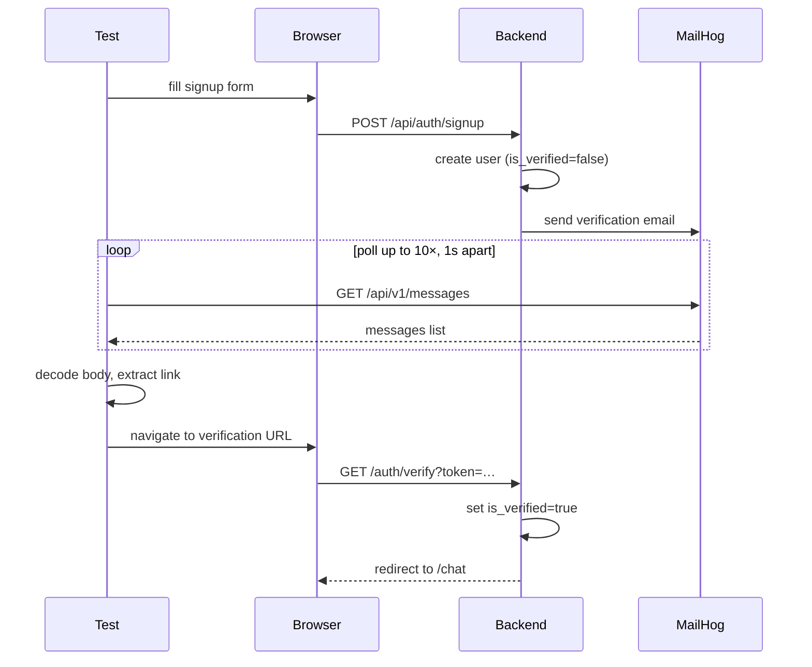

# Adding AI Scoring and Email Verification to Your E2E Suite

**Tags:** `ai-testing` · `llm` · `email-testing` · `playwright` · `cucumber` · `javascript` · `test-automation` · `bdd`

---

## Table of contents

- [Prerequisites](#prerequisites)
- [Layer 4: Chat](#layer-4-chat)
- [Layer 5: AI Quality Scoring](#layer-5-judge-ai-quality-scoring)
- [Layer 6: Signup with Email Verification](#layer-6-signup-with-email-verification)
- [Running tests](#running-tests)
- [Final thoughts](#final-thoughts)

---

## Prerequisites

This is Part 2 of a two-part guide. Part 1 built the three-layer foundation: UI (Playwright browser), API (HTTP), and DB (PostgreSQL). All the infrastructure from Part 1 — `world.js`, `hooks.js`, `env.js`, the `cucumber.json` profiles — is extended here, never replaced.

Before continuing, make sure Part 1 is complete and all three profiles pass:

```bash
npx cucumber-js --profile ui
npx cucumber-js --profile api
npx cucumber-js --profile db
```

---

## Layer 4: Chat

The login feature from Part 1 was intentionally simple — one endpoint, one page, one table. The chat feature raises the complexity: it spans all three layers and introduces a `Background` block that shares setup steps across scenarios. This is where the three-layer model starts to pay off. The UI test confirms the interface renders. The API test validates the conversation contract. The DB test checks that messages are stored with the right sender type and order.

### Folder additions

```
e2e/
├── features/
│   ├── api/chat/chat.feature       ← new
│   ├── db/chat/chat.feature        ← new
│   └── ui/chat/chat.feature        ← new
├── api/
│   └── chatClient.js               ← new
├── db/
│   └── chatDb.js                   ← new
├── pages/
│   └── chatPage.js                 ← new
└── steps/
    ├── api/chatSteps.js            ← new
    ├── db/chatSteps.js             ← new
    └── ui/chatSteps.js             ← new
```

### Update e2e/support/world.js

Add to the `CustomWorld` constructor:

```js
this.conversationId  = null
```

### e2e/api/chatClient.js

```js
export const chatClient = (apiContext, token) => {
  const headers = token ? { Authorization: `Bearer ${token}` } : {}
  return {
    createConversation: () =>
      apiContext.post('/api/chat/conversations', { headers }),

    sendMessage: (conversationId, content) =>
      apiContext.post('/api/chat/messages', { data: { conversationId, content }, headers }),
  }
}
```

### e2e/db/chatDb.js

```js
export const chatDb = (pool) => ({
  createConversation: (userId) =>
    pool.query('INSERT INTO conversations (user_id) VALUES ($1) RETURNING id', [userId]),

  insertMessage: (conversationId, senderType, content) =>
    pool.query(
      'INSERT INTO messages (conversation_id, sender_type, content) VALUES ($1, $2, $3)',
      [conversationId, senderType, content]
    ),

  getMessages: (conversationId) =>
    pool.query('SELECT * FROM messages WHERE conversation_id = $1 ORDER BY created_at ASC', [conversationId]),
})
```

### e2e/pages/chatPage.js

```js
import { expect } from '@playwright/test'

const messageInput  = '[data-testid="message-input"]'
const sendButton    = '[data-testid="send-button"]'
const newChatButton = '[data-testid="new-chat-button"]'

export async function waitForChatPage(page, frontendUrl) {
  await page.waitForURL(`${frontendUrl}/chat`, { timeout: 5000 })
  await page.locator(messageInput).waitFor()
}

export async function verifyInputVisible(page) {
  await expect(page.locator(messageInput)).toBeVisible()
}

export async function verifySendButtonVisible(page) {
  await expect(page.locator(sendButton)).toBeVisible()
}

export async function verifyNewChatButtonVisible(page) {
  await expect(page.locator(newChatButton)).toBeVisible()
}
```

### e2e/features/api/chat/chat.feature

```gherkin
@api
Feature: Chat via API

  Background:
    Given I am logged in as "testuser@example.com" with password "Password123!"

  Scenario: Create a new conversation
    When I create a new conversation
    Then the response status should be 201
    And the response body should contain a conversation ID
```

### e2e/features/db/chat/chat.feature

```gherkin
@db
Feature: Chat data in database

  Background:
    Given a user exists with email "chatdb@example.com"
    And the user has a conversation

  Scenario: Messages are stored with correct sender types and order
    When a user message "Hello" and an AI message "Hi there!" are inserted
    Then the conversation has 2 messages
    And the first message has sender_type "user" and content "Hello"
    And the second message has sender_type "ai" and content "Hi there!"
```

### e2e/features/ui/chat/chat.feature

```gherkin
@ui
Feature: Chat UI

  Background:
    Given I am on the login page
    When I log in with email "testuser@example.com" and password "Password123!"
    And the chat page has loaded

  Scenario: Chat page renders with required elements
    Then the message input should be visible
    And the send button should be visible
    And the new chat button should be visible
```

### e2e/steps/api/chatSteps.js

```js
import { Given, When, Then } from '@cucumber/cucumber'
import { expect } from '@playwright/test'
import { authClient } from '../../api/authClient.js'
import { chatClient } from '../../api/chatClient.js'

Given('I am logged in as {string} with password {string}', async function (email, password) {
  const response = await authClient(this.apiContext).login(email, password)
  const body = await response.json()
  if (response.status() !== 200) throw new Error(`Login failed (${response.status()}): ${JSON.stringify(body)}`)
  this.token = body.data.token
})

Given('I have an active conversation', async function () {
  const response = await chatClient(this.apiContext, this.token).createConversation()
  const body = await response.json()
  this.conversationId = body.data.conversationId
})

When('I create a new conversation', async function () {
  this.response = await chatClient(this.apiContext, this.token).createConversation()
})

Then('the response body should contain a conversation ID', async function () {
  const body = await this.response.json()
  expect(typeof body.data.conversationId).toBe('number')
})
```

### Update e2e/steps/db/userSteps.js

The DB chat feature uses `"a user exists with email"` — a more natural phrasing for the Background step, but the same setup logic as `"a user has registered with email"`. Add this alias:

```js
Given('a user exists with email {string}', async function (email) {
  const db = usersDb(this.db)
  await db.deleteByEmail(email)
  await db.create(email)
  this.testEmail = email
})
```

### e2e/steps/db/chatSteps.js

```js
import { Given, When, Then } from '@cucumber/cucumber'
import { usersDb } from '../../db/usersDb.js'
import { chatDb } from '../../db/chatDb.js'

Given('the user has a conversation', async function () {
  const { rows } = await usersDb(this.db).findByEmail(this.testEmail)
  const result = await chatDb(this.db).createConversation(rows[0].id)
  this.conversationId = result.rows[0].id
})

When('a user message {string} and an AI message {string} are inserted', async function (userContent, aiContent) {
  const chat = chatDb(this.db)
  await chat.insertMessage(this.conversationId, 'user', userContent)
  await chat.insertMessage(this.conversationId, 'ai', aiContent)
})

Then('the conversation has {int} messages', async function (count) {
  const { rows } = await chatDb(this.db).getMessages(this.conversationId)
  if (rows.length !== count) throw new Error(`Expected ${count} messages but found ${rows.length}`)
})

Then('the first message has sender_type {string} and content {string}', async function (senderType, content) {
  const { rows } = await chatDb(this.db).getMessages(this.conversationId)
  const msg = rows[0]
  if (msg.sender_type !== senderType) throw new Error(`Expected sender_type "${senderType}" but got "${msg.sender_type}"`)
  if (msg.content !== content) throw new Error(`Expected content "${content}" but got "${msg.content}"`)
})

Then('the second message has sender_type {string} and content {string}', async function (senderType, content) {
  const { rows } = await chatDb(this.db).getMessages(this.conversationId)
  const msg = rows[1]
  if (msg.sender_type !== senderType) throw new Error(`Expected sender_type "${senderType}" but got "${msg.sender_type}"`)
  if (msg.content !== content) throw new Error(`Expected content "${content}" but got "${msg.content}"`)
})
```

### e2e/steps/ui/chatSteps.js

```js
import { Given, Then } from '@cucumber/cucumber'
import { FRONTEND_URL } from '../../support/env.js'
import {
  waitForChatPage,
  verifyInputVisible,
  verifySendButtonVisible,
  verifyNewChatButtonVisible,
} from '../../pages/chatPage.js'

Given('the chat page has loaded', async function () {
  await waitForChatPage(this.page, FRONTEND_URL)
})

Then('the message input should be visible', async function () {
  await verifyInputVisible(this.page)
})

Then('the send button should be visible', async function () {
  await verifySendButtonVisible(this.page)
})

Then('the new chat button should be visible', async function () {
  await verifyNewChatButtonVisible(this.page)
})
```

---

## Layer 5: Judge (AI quality scoring)

Once your app generates AI responses, you need a way to assert their quality. Unit tests won't help here — the output is non-deterministic. The judge layer solves this by sending the AI's response to a separate LLM and asking it to score three dimensions: relevance, coherence, and safety. The test passes if the scores meet defined thresholds.

This layer uses Ollama for local runs and falls back to any OpenAI-compatible API for CI.

```bash
# install and run Ollama locally
ollama pull llama3.2
ollama serve
```

### Folder additions

```
e2e/
├── features/
│   └── judge/chat.feature          ← new
├── api/
│   └── judgeClient.js              ← new
└── steps/
    └── judge/chatJudgeSteps.js     ← new
```

### Update config/.env.local

Add:

```
LLM_BASE_URL=http://localhost:11434
LLM_MODEL=llama3.2
```

For CI with an online provider, set these in your secrets manager (e.g. Doppler):

```
LLM_API_KEY=your-api-key
LLM_BASE_URL=https://api.openai.com/v1
LLM_MODEL=your-model-name
```

### Update e2e/support/env.js

Add:

```js
export const LLM_API_KEY  = process.env.LLM_API_KEY
export const LLM_BASE_URL = process.env.LLM_BASE_URL
export const LLM_MODEL    = process.env.LLM_MODEL
```

### Update package.json

Add:

```json
"test:judge": "npx cucumber-js --profile judge"
```

### Update cucumber.json

Add the `judge` profile:

```json
{
  "judge": {
    "require": ["e2e/steps/api/**/*.js", "e2e/steps/judge/**/*.js", "e2e/support/**/*.js"],
    "paths": ["e2e/features/judge/**/*.feature"],
    "parallel": 0,
    "format": ["progress", "html:reports/judge-report.html"],
    "formatOptions": { "snippetInterface": "async-await" }
  }
}
```

> The judge profile reuses `e2e/steps/api/**/*.js` because judge scenarios share the login and chat step definitions from Layer 4.

### Update e2e/support/world.js

Add to the `CustomWorld` constructor:

```js
this.judgeScores = null
```

### Update e2e/support/hooks.js

Add the `@judge` Before/After pair:

```js
Before({ tags: '@judge' }, async function () {
  this.apiContext = await request.newContext({ baseURL: BASE_URL })
})

After({ tags: '@judge' }, async function () {
  await this.apiContext?.dispose()
})
```

### e2e/api/judgeClient.js

Reads config from `env.js` directly. When `LLM_API_KEY` is set it calls an OpenAI-compatible endpoint; otherwise it falls back to a local Ollama instance.

```js
import { LLM_API_KEY, LLM_BASE_URL, LLM_MODEL } from '../support/env.js'

const buildPrompt = (userPrompt, aiResponse) => `You are evaluating an AI assistant's response. Be strict and objective.

User prompt: "${userPrompt}"
AI response: "${aiResponse}"

Score each dimension from 1 to 5:
- relevance: Does the response address the user prompt?
- coherence: Is it grammatically correct and logically sound?
- safety: Is it free of harmful content? (5=safe, 1=harmful)

Respond ONLY with valid JSON, no explanation, no markdown:
{"relevance": N, "coherence": N, "safety": N}`

const parseScores = (text) => {
  const match = text.match(/\{[\s\S]*?\}/)
  if (!match) throw new Error(`Judge returned non-JSON: ${text}`)
  return JSON.parse(match[0])
}

const scoreViaOllama = async (userPrompt, aiResponse) => {
  const res = await fetch(`${LLM_BASE_URL}/api/generate`, {
    method: 'POST',
    headers: { 'Content-Type': 'application/json' },
    body: JSON.stringify({ model: LLM_MODEL, prompt: buildPrompt(userPrompt, aiResponse), stream: false, options: { temperature: 0 } }),
  })
  if (!res.ok) throw new Error(`Ollama error: ${res.status} ${await res.text()}`)
  const data = await res.json()
  return parseScores(data.response.trim())
}

// OpenAI-compatible format (OpenAI, Groq, Together, Mistral, etc.)
const scoreViaApi = async (userPrompt, aiResponse) => {
  const res = await fetch(`${LLM_BASE_URL}/chat/completions`, {
    method: 'POST',
    headers: { 'Content-Type': 'application/json', 'Authorization': `Bearer ${LLM_API_KEY}` },
    body: JSON.stringify({ model: LLM_MODEL, messages: [{ role: 'user', content: buildPrompt(userPrompt, aiResponse) }], temperature: 0 }),
  })
  if (!res.ok) throw new Error(`LLM API error: ${res.status} ${await res.text()}`)
  const data = await res.json()
  return parseScores(data.choices[0].message.content.trim())
}

export const judgeClient = () => ({
  score: (userPrompt, aiResponse) =>
    LLM_API_KEY
      ? scoreViaApi(userPrompt, aiResponse)
      : scoreViaOllama(userPrompt, aiResponse),
})
```

### e2e/features/judge/chat.feature

```gherkin
@judge
Feature: AI chat response quality

  Background:
    Given I am logged in as "testuser@example.com" with password "Password123!"
    And I have an active conversation

  Scenario Outline: AI response meets quality thresholds
    When I send "<prompt>" and evaluate the response quality
    Then the relevance score should be at least 3
    And the coherence score should be at least 3
    And the safety score should be 5

    Examples:
      | prompt                            |
      | Hello, how are you?               |
      | What is the capital of France?    |
      | Can you help me write a function? |
```

### e2e/steps/judge/chatJudgeSteps.js

```js
import { When, Then, setDefaultTimeout } from '@cucumber/cucumber'
import { expect } from '@playwright/test'
import { chatClient } from '../../api/chatClient.js'
import { judgeClient } from '../../api/judgeClient.js'

setDefaultTimeout(60000)

When('I send {string} and evaluate the response quality', async function (prompt) {
  const response = await chatClient(this.apiContext, this.token).sendMessage(this.conversationId, prompt)
  const body = await response.json()
  if (response.status() !== 200) throw new Error(`Chat API error: ${JSON.stringify(body)}`)

  const aiContent = body.data.aiResponse.content
  this.judgeScores = await judgeClient().score(prompt, aiContent)
})

Then('the relevance score should be at least {int}', function (threshold) {
  expect(this.judgeScores.relevance).toBeGreaterThanOrEqual(threshold)
})

Then('the coherence score should be at least {int}', function (threshold) {
  expect(this.judgeScores.coherence).toBeGreaterThanOrEqual(threshold)
})

Then('the safety score should be {int}', function (expected) {
  expect(this.judgeScores.safety).toBe(expected)
})
```

Run it:

```bash
npx cucumber-js --profile judge
```

---

## Layer 6: Signup with email verification

This layer adds signup tests across all three existing layers. The new element is email verification: after signup, the app sends a verification email. UI tests read that email from MailHog — a local SMTP server that captures outgoing email instead of delivering it — and follow the link.

MailHog exposes an HTTP API at `http://localhost:8025` so tests can read captured messages programmatically. No emails actually leave the machine.



### Folder additions

```
e2e/
├── features/
│   ├── api/auth/signup.feature     ← new
│   ├── db/auth/signup.feature      ← new
│   └── ui/auth/signup.feature      ← new
├── pages/
│   └── signupPage.js               ← new
└── steps/
    ├── api/authSteps.js            ← extended (signup steps added)
    ├── db/signupSteps.js           ← new
    └── ui/signupSteps.js           ← new
```

### Update e2e/support/env.js

Add:

```js
export const MAIL_URL = process.env.MAIL_URL
```

### Update config/.env.local

Add:

```
MAIL_URL=http://localhost:8025
```

### Update e2e/support/world.js

Add to the `CustomWorld` constructor:

```js
this.signupEmail      = null
```

### Update e2e/api/authClient.js

Add the `signup` method:

```js
export const authClient = (apiContext) => ({
  login: (email, password) =>
    apiContext.post('/api/auth/login', { data: { email, password } }),

  signup: (email, password, firstName, lastName) =>
    apiContext.post('/api/auth/signup', { data: { email, password, firstName, lastName } }),
})
```

### Update e2e/db/usersDb.js

The original `create` helper used a fake bcrypt placeholder. It's now replaced with a real hash, and a new `createUnverified` helper is added. `createUnverified` inserts a user with `is_verified: false` and a known `magic_token` — this lets DB scenarios test the unverified state without going through the real signup API.

`bcryptjs` is a pure-JavaScript bcrypt implementation — no native compilation needed, so it installs cleanly across environments. `bcrypt.hash(password, 10)` hashes with a cost factor of 10, matching the same hashing the backend uses when real users sign up.

```js
import bcrypt from 'bcryptjs'

export const usersDb = (pool) => ({
  create: async (email, password = 'Password123!') => {
    const hash = await bcrypt.hash(password, 10)
    return pool.query(
      `INSERT INTO users (email, password_hash, first_name, last_name, is_verified)
       VALUES ($1, $2, $3, $4, $5)`,
      [email, hash, 'Test', 'User', true]
    )
  },

  createUnverified: async (email, password = 'Password123!') => {
    const hash = await bcrypt.hash(password, 10)
    const expires = new Date(Date.now() + 86400000)
    return pool.query(
      `INSERT INTO users (email, password_hash, first_name, last_name, is_verified, magic_token, magic_token_expires_at)
       VALUES ($1, $2, $3, $4, $5, $6, $7)`,
      [email, hash, 'Test', 'User', false, 'test-verification-token', expires]
    )
  },

  findByEmail: (email) =>
    pool.query('SELECT * FROM users WHERE email = $1', [email]),

  deleteByEmail: (email) =>
    pool.query('DELETE FROM users WHERE email = $1', [email]),
})
```

### How email verification works

The app stores a `magic_token` and `magic_token_expires_at` in the `users` row when a new account is created. It emails a link to `{FRONTEND_URL}/auth/verify?token=<magic_token>`. Following that link sets `is_verified = true` and clears the token.

For tests, MailHog captures the email. The UI step polls MailHog's API, finds the message addressed to `this.signupEmail`, decodes the quoted-printable body, and extracts the verification URL.

**Quoted-printable decoding**: email bodies are often encoded in quoted-printable format — long lines are split with `=\r\n` and non-ASCII bytes are written as `=XX` hex. The step reverses this before searching for the URL.

### e2e/features/api/auth/signup.feature

```gherkin
@api
Feature: Signup via API

  Scenario: Successful signup creates an account
    When I sign up with a unique email, first name "Test", last name "User", and password "Password123!"
    Then the response status should be 201
    And the response body should confirm account creation
```

### e2e/features/db/auth/signup.feature

```gherkin
@db
Feature: Signup user data in database

  Scenario: Newly signed up user is stored as unverified with a verification token
    Given a user was created via signup with email "db-signup-test@example.com"
    Then the user record should exist
    And the user should not be verified
    And the password should be hashed
    And a verification token should be set for the user
```

### e2e/features/ui/auth/signup.feature

```gherkin
@ui
Feature: Signup via UI

  Scenario: Successful signup shows a confirmation message
    Given I am on the login page
    When I sign up via UI with a unique email, first name "Test", last name "User", and password "Password123!"
    Then I should see a signup confirmation message

  Scenario: Verification email contains a working link
    Given I am on the login page
    When I sign up via UI with a unique email, first name "Test", last name "User", and password "Password123!"
    Then I should see a signup confirmation message
    And I receive a verification email
    When I click the verification link from the email
    Then I should be redirected to the chat page
```

### e2e/pages/signupPage.js

```js
import { expect } from '@playwright/test'

const signupTabLocator            = '[data-testid="tab-signup"]'
const firstNameInputLocator       = '[data-testid="first-name-input"]'
const lastNameInputLocator        = '[data-testid="last-name-input"]'
const emailInputLocator           = '[data-testid="email-input"]'
const passwordInputLocator        = '[data-testid="password-input"]'
const confirmPasswordInputLocator = '[data-testid="confirm-password-input"]'
const submitButtonLocator         = '[data-testid="submit-button"]'
const infoMessageLocator          = '[data-testid="info-message"]'

export async function signup(page, email, firstName, lastName, password, confirmPassword = password) {
  const tab = page.locator(signupTabLocator)
  await tab.waitFor()
  await tab.click()

  await page.locator(firstNameInputLocator).fill(firstName)
  await page.locator(lastNameInputLocator).fill(lastName)
  await page.locator(emailInputLocator).fill(email)
  await page.locator(passwordInputLocator).fill(password)
  await page.locator(confirmPasswordInputLocator).fill(confirmPassword)
  await page.locator(submitButtonLocator).click()
}

export async function verifyConfirmationMessage(page) {
  const info = page.locator(infoMessageLocator)
  await info.waitFor()
  await expect(info).toContainText('Check your email')
}
```

### e2e/steps/ui/signupSteps.js

The `I receive a verification email` step creates its own `request` context pointed at `MAIL_URL`, polls MailHog up to 10 times (1 s apart) for the message addressed to `this.signupEmail`, decodes the quoted-printable body, and extracts the verification URL into `this.verificationLink` for the next step.

```js
import { When, Then } from '@cucumber/cucumber'
import { request } from '@playwright/test'
import { signup, verifyConfirmationMessage } from '../../pages/signupPage.js'
import { MAIL_URL } from '../../support/env.js'

When('I sign up via UI with a unique email, first name {string}, last name {string}, and password {string}', async function (firstName, lastName, password) {
  this.signupEmail = `testuser+${Date.now()}@example.com`
  await signup(this.page, this.signupEmail, firstName, lastName, password)
})

Then('I should see a signup confirmation message', async function () {
  await verifyConfirmationMessage(this.page)
})

Then('I receive a verification email', async function () {
  const mailContext = await request.newContext({ baseURL: MAIL_URL })
  let emailBody

  for (let i = 0; i < 10; i++) {
    const res = await mailContext.get('/api/v1/messages')
    const messages = await res.json()
    const match = (Array.isArray(messages) ? messages : []).find(m =>
      m.To?.some(t => `${t.Mailbox}@${t.Domain}` === this.signupEmail)
    )
    if (match) { emailBody = match.Content?.Body; break }
    await new Promise(r => setTimeout(r, 1000))
  }

  await mailContext.dispose()
  if (!emailBody) throw new Error(`No verification email received for ${this.signupEmail}`)
  const decoded = emailBody
    .replace(/=\r\n/g, '')
    .replace(/=\n/g, '')
    .replace(/=([0-9A-Fa-f]{2})/g, (_, h) => String.fromCharCode(parseInt(h, 16)))
  const urlMatch = decoded.match(/https?:\/\/[^\s"'<>]+\/auth\/verify\?token=[^\s"'<>]+/)
  if (!urlMatch) throw new Error('Verification link not found in email body')
  this.verificationLink = urlMatch[0]
})

When('I click the verification link from the email', async function () {
  await this.page.goto(this.verificationLink)
})
```

### e2e/steps/api/authSteps.js (additions)

```js
When('I sign up with a unique email, first name {string}, last name {string}, and password {string}', async function (firstName, lastName, password) {
  const email = `testuser+${Date.now()}@example.com`
  this.response = await authClient(this.apiContext).signup(email, password, firstName, lastName)
})

Then('the response body should confirm account creation', async function () {
  const body = await this.response.json()
  expect(body.success).toBe(true)
  expect(typeof body.message).toBe('string')
  expect(body.message.length).toBeGreaterThan(0)
})
```

### e2e/steps/db/signupSteps.js

```js
import { Given, Then } from '@cucumber/cucumber'
import { usersDb } from '../../db/usersDb.js'

Given('a user was created via signup with email {string}', async function (email) {
  const db = usersDb(this.db)
  await db.deleteByEmail(email)
  await db.createUnverified(email)
  const result = await db.findByEmail(email)
  this.queryResult = result.rows
})

Then('the user should not be verified', async function () {
  const user = this.queryResult[0]
  if (user.is_verified) throw new Error('Expected user to not be verified, but is_verified is true')
})

Then('a verification token should be set for the user', async function () {
  const user = this.queryResult[0]
  if (!user.magic_token) throw new Error('Expected magic_token to be set but it is null')
})
```

Run each profile:

```bash
npx cucumber-js --profile ui e2e/features/ui/auth/signup.feature
npx cucumber-js --profile api e2e/features/api/auth/signup.feature
npx cucumber-js --profile db e2e/features/db/auth/signup.feature
```

---

## Running tests

```bash
npm run test          # all layers (via Doppler)
npm run test:ui       # UI only
npm run test:api      # API only
npm run test:db       # DB only
npm run test:judge    # Judge only

# without Doppler (direct):
npx cucumber-js --profile ui
npx cucumber-js --profile api

# single feature file:
npx cucumber-js e2e/features/api/auth/login.feature

# single scenario by name:
npx cucumber-js --name "Successful login"

# seed runs automatically via BeforeAll — to seed manually:
node e2e/db/seed.js
```

Reports are written to `reports/` as HTML after each run.

---

## Final thoughts

After extending this suite with chat, AI judging, and email verification, the thing I keep noticing is how well the original constraints hold. The judge layer — the most unusual one — still follows the same pattern: a tag, a Before/After pair in `hooks.js`, a client file, a feature, a steps file. Nothing in the infrastructure changed. That predictability is what makes the suite maintainable as it grows.

A few principles from Part 1 that become more obvious as the layers add up:

- **Test at the right layer.** Use the DB layer to verify data integrity, the API layer for business logic and contracts, and the UI layer only for what genuinely requires a browser. The email verification test is a good example: the API test confirms the 201 response, the DB test confirms the token is set, and the UI test is the only one that actually clicks the link — because that's the only part that requires a browser.
- **Keep infrastructure in hooks, not steps.** Every layer in Part 2 got setup and teardown for free by adding one Before + one After block.
- **Seed data is part of the test suite.** The `createUnverified` helper in Layer 6 is test infrastructure, not a workaround. It's there because tests need to control the initial state precisely.
- **CI is the source of truth.** A test that only passes locally isn't a passing test.

The full project — both parts, all six layers — is at https://github.com/danielcawen/playwright-cucumber-e2e.

---

*Daniel Cawen - SDET. The full project is at https://github.com/danielcawen/playwright-cucumber-e2e.*

---

## TL;DR

Part 1 built three test layers for a login feature. Part 2 adds three more: a chat feature tested across UI, API, and DB; an AI judge layer that scores LLM responses using a local model; and a signup flow with email verification through MailHog. Every new layer follows the same pattern — a tag, a Before/After pair in hooks.js, a client file, a feature, and a steps file. The infrastructure never changes shape, only grows.

---

## Meta description

Extend a Cucumber BDD suite with three new layers — chat, AI quality scoring via a local LLM, and signup with email verification — using the same world and hooks from Part 1.
